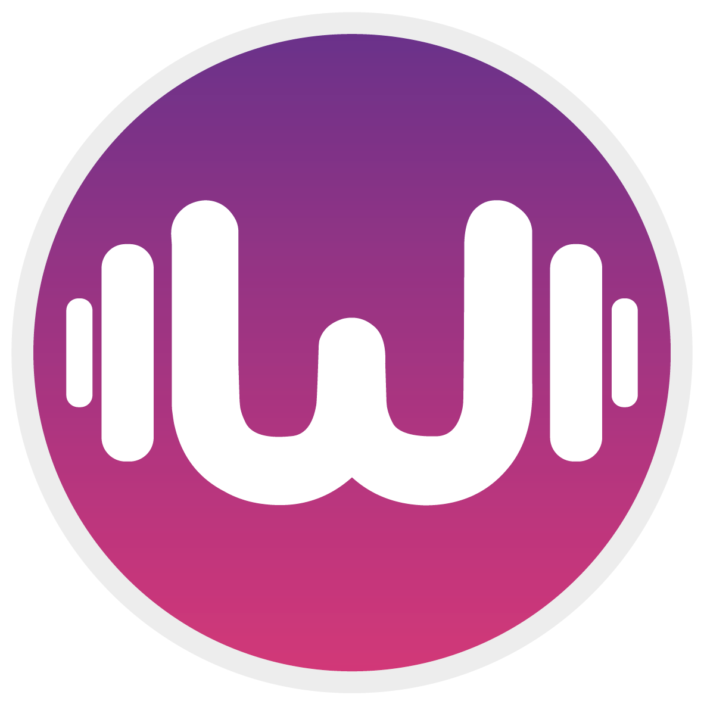

# WaynessMarketing

## Aplicación de Medición de Ejercicio y Recompensas

>Descripción:

Esta aplicación tiene como objetivo motivar a las personas a realizar ejercicio físico a través de un sistema de puntos canjeables.

>Funcionalidades:

Medición del ejercicio: La app utiliza el sensor de movimiento del dispositivo para registrar la actividad física del usuario, como pasos caminados, distancia recorrida, calorías quemadas y tiempo de ejercicio.
Cálculo de puntos: Con base en la actividad registrada, la app calcula una cantidad de puntos que el usuario obtiene por su esfuerzo.

Predicción de puntos: La app utiliza un algoritmo de aprendizaje automático para predecir la cantidad de puntos que el usuario obtendrá por una sesión de ejercicio específica.

Mercado de recompensas: Los puntos acumulados por el usuario se pueden canjear por diversos premios en un mercado virtual, como descuentos en productos o servicios relacionados con la salud y el bienestar.

>Tecnologías:

Lenguaje de programación: Python, Markdoown, HTML, CSS, Stramlib
Base de datos: Datos ejemplo de diferentes personas haciendo ejercicio un determinada cantidad de minutos.
Algoritmo de aprendizaje automático: ML, SKLearn

>Requisitos:

Dispositivo móvil con sensor de movimiento.
Conexión a internet.
Cuenta de usuario en la aplicación.

>Instrucciones de uso:

Crea una cuenta de usuario o inicia sesión con tu cuenta existente.
Activa el sensor de movimiento de tu dispositivo.
Comienza a realizar ejercicio físico.

La app registrará tu actividad y te mostrará la cantidad de puntos obtenidos.
Accede al mercado de recompensas y canjea tus puntos por los premios que desees.

>Contribuciones:

¡Te invitamos a contribuir a este proyecto! Puedes hacerlo de las siguientes maneras:

Reportando errores o problemas en el repositorio de GitHub.
Sugiriendo nuevas funcionalidades o mejoras.
Ayudando a traducir la aplicación a otros idiomas.

>Contacto:

Para cualquier pregunta o comentario, puedes contactarnos a través de waynessapp@gmail.com

